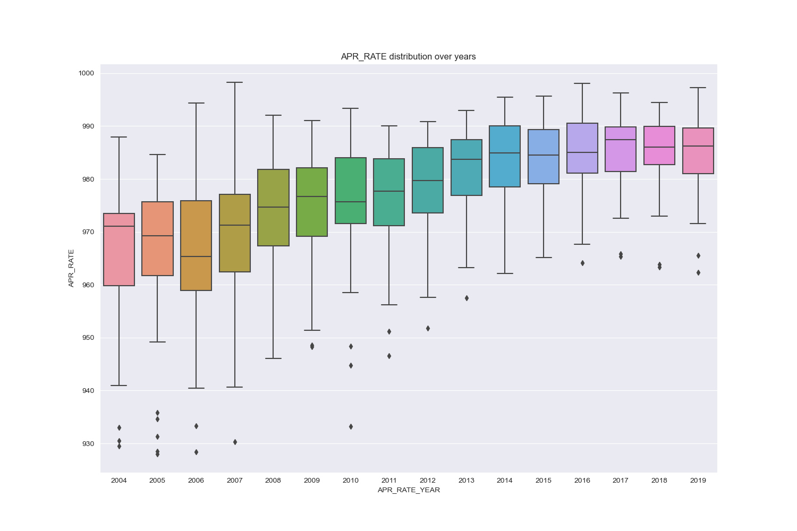
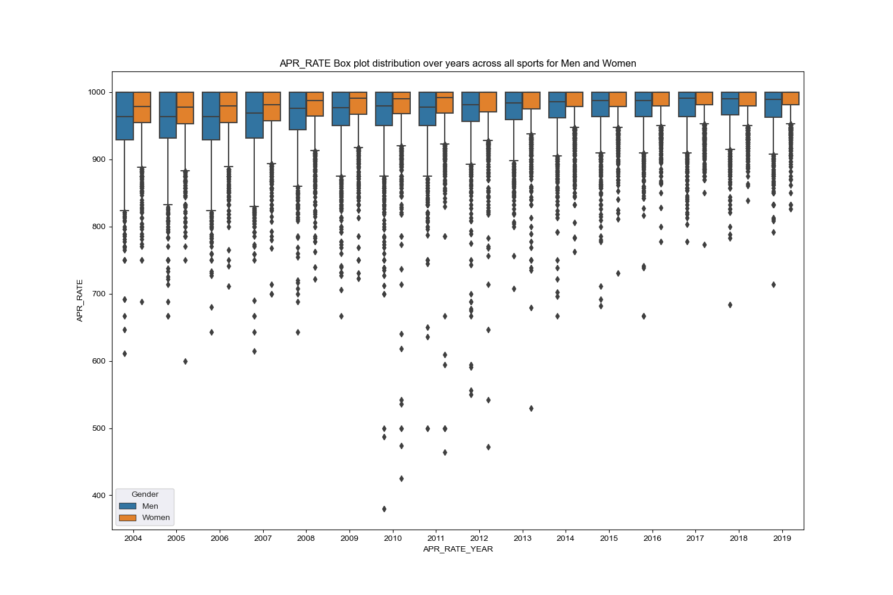
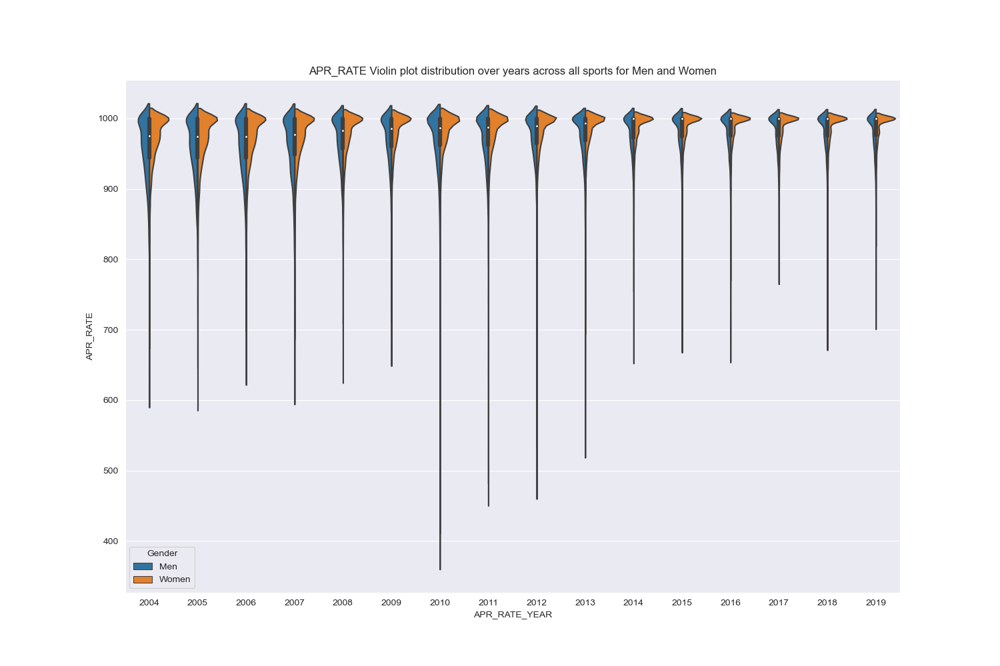
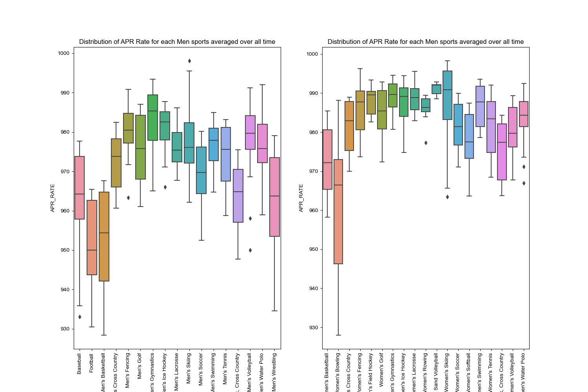

# hw-ncaa

The Academic Progress Rate or APR was implemented in 2003 by the NCAA to hold institutions accountable 
for the progress of their athletes. 
It is a team based metric that measures the eligibility and retention.
A score below 930 results in the sanctions such as reduction in scholarships or practice time.

EDA of academic progress ratings (APR) in the NCAA...

1. Evolution over time for distributions of aggregated APR for all institutions and sports.
2. Evolution over time for distributions of APR, resolving differences between men's & women's sports.
3. Comparison of APR distributions for men's & women's sports, resolving individual sports averaged over all years.
  * In each case, comment on the major findings (takeaways) from your visualizations.
  * Keep things simple.
  * Label the plots.
* [NCAA academic progress rate (APR)](https://www.ncaa.org/about/resources/research/shared-ncaa-research-data). 
  * This page has links to data and documentation for the NCAA Academic Progress Rates (APRs) of student-athletes. 
  * As of 2023, the CSV for 2004-2019 was last updated in May 2020.
* Each question is worth 2.5 points.
* Recommendations:
  * It's easiest to solve the entire assignment after first organizing the data into a long form (tidy) data structure as described in the [Seaborn documentation](https://seaborn.pydata.org/tutorial/data_structure.html). 
  * Consider using the [pandas.melt()](https://pandas.pydata.org/docs/reference/api/pandas.melt.html) method
  * You can answer Questions 1-3 by visualizing distributions with boxplots.
  * You can answer Questions 1 & 2 with one call (each) to seaborn, each using one set of axes. 
  * Question 3 may require 2 sets of axes.
  * Each question is worth 2.5 points.
  * Although boxplots will serve the purpose of the assignment, you may find that another visualization tells the story particularly well. Feel free to use another approach if you like, just make sure to justify your choice. This is a rich dataset. Extra credit for creative EDA that extends beyond the requirements of the assignment.

## Question 0

Implement the DRY principle by putting all your preprocessing into one or more functions that get 
used by each question below.
Each question can be answered with one call to seaborn (except for the the last question, which can involve 2 calls).
Each question should be answered with one file.

## Question 1

Visualize the evolution of APR distributions over time (averaging all sports, both men's & women's; one set of axes).
Comment on the major finding(s).

## Question 2

Create a visualization that compares the evolution over time of APR distributions 
for men’s and women’s sports (one set of axes). Comment on the major finding(s).

# Question 3

Compare APRs for individual sports averaged over all time, 
with one set of axes for Men's and another for Women's.
Comment on the major finding(s).

